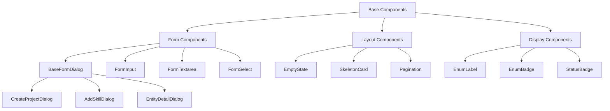
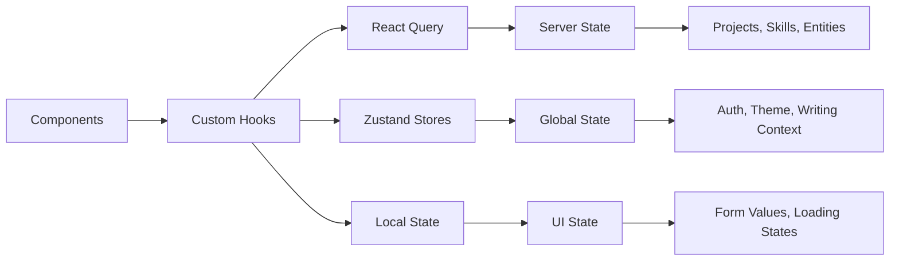

# Design Document

## Overview

This design outlines a systematic refactoring approach to consolidate the Novel Agent Frontend codebase, reducing code duplication by 30-40% while improving maintainability and consistency. The refactoring follows established React patterns including compound components, container/presentation separation, and centralized state management.

The approach prioritizes backward compatibility and incremental migration, allowing existing components to be gradually replaced without breaking functionality.

## Architecture

### Component Hierarchy



### State Management Architecture



## Components and Interfaces

### 1. Base Form Dialog Component

**Purpose**: Consolidate 15+ dialog components with consistent structure and behavior.

**Interface**:
```typescript
interface BaseFormDialogProps {
  open: boolean;
  onOpenChange: (open: boolean) => void;
  title: string;
  description?: string;
  icon?: React.ComponentType<{ className?: string }>;
  maxWidth?: 'sm' | 'md' | 'lg' | 'xl' | '2xl' | '3xl';
  children: React.ReactNode;
  footer?: React.ReactNode;
  loading?: boolean;
  onSubmit?: (e: React.FormEvent) => void;
}
```

**Features**:
- Consistent header with title, optional icon, and description
- Scrollable content area with proper overflow handling
- Standardized footer with cancel/action buttons
- Loading state management with disabled interactions
- Keyboard navigation support (Enter to submit, Escape to close)
- Responsive sizing with predefined width options

### 2. Form Input Components

**Purpose**: Standardize form field styling and behavior across all components.

**Components**:
- `FormInput` - Text input with consistent styling
- `FormTextarea` - Multi-line text input with character count
- `FormSelect` - Dropdown selection with enum support
- `FormLabel` - Consistent label styling and typography
- `FormError` - Error message display with consistent styling

**Shared Interface**:
```typescript
interface BaseFormFieldProps {
  label?: string;
  error?: string;
  required?: boolean;
  disabled?: boolean;
  className?: string;
  description?: string;
}

interface FormInputProps extends BaseFormFieldProps {
  value: string;
  onChange: (value: string) => void;
  placeholder?: string;
  type?: 'text' | 'email' | 'password' | 'url';
}

interface FormTextareaProps extends BaseFormFieldProps {
  value: string;
  onChange: (value: string) => void;
  placeholder?: string;
  maxLength?: number;
  showCharCount?: boolean;
  rows?: number;
}
```

**Styling Standards**:
- Background: `bg-background/50`
- Focus ring: `focus-visible:ring-1 focus-visible:ring-primary/30`
- Border: `border-border/50`
- Error state: `border-destructive/50 focus-visible:ring-destructive/30`

### 3. Empty State Component

**Purpose**: Provide consistent empty state UI across all list/grid components.

**Interface**:
```typescript
interface EmptyStateProps {
  icon: React.ComponentType<{ className?: string }>;
  title: string;
  description: string;
  action?: {
    label: string;
    onClick: () => void;
    variant?: 'default' | 'outline' | 'ghost';
  };
  className?: string;
}
```

**Usage Pattern**:
```tsx
<EmptyState
  icon={FileText}
  title="No projects found"
  description="Create your first project to get started with novel writing."
  action={{
    label: "Create Project",
    onClick: () => setCreateDialogOpen(true)
  }}
/>
```

### 4. Mutation Loading Hook

**Purpose**: Standardize loading state management following tech.md guidance to avoid race conditions.

**Interface**:
```typescript
interface UseMutationLoadingOptions<TData, TError, TVariables> {
  mutationFn: (variables: TVariables) => Promise<TData>;
  onSuccess?: (data: TData, variables: TVariables) => void;
  onError?: (error: TError, variables: TVariables) => void;
  onSettled?: (data: TData | undefined, error: TError | null, variables: TVariables) => void;
}

interface UseMutationLoadingReturn<TData, TError, TVariables> {
  mutate: (variables: TVariables) => Promise<TData>;
  isLoading: boolean;
  error: TError | null;
  data: TData | undefined;
}
```

**Implementation Pattern**:
```typescript
function useMutationLoading<TData, TError, TVariables>(
  options: UseMutationLoadingOptions<TData, TError, TVariables>
): UseMutationLoadingReturn<TData, TError, TVariables> {
  const [isLoading, setIsLoading] = useState(false);
  
  const mutation = useMutation({
    mutationFn: options.mutationFn,
    onSuccess: options.onSuccess,
    onError: options.onError,
    onSettled: options.onSettled,
  });

  const mutate = useCallback(async (variables: TVariables) => {
    setIsLoading(true);
    try {
      const result = await mutation.mutateAsync(variables);
      return result;
    } finally {
      setIsLoading(false);
    }
  }, [mutation]);

  return {
    mutate,
    isLoading,
    error: mutation.error,
    data: mutation.data,
  };
}
```

### 5. Delete Confirmation Hook

**Purpose**: Standardize delete operations with consistent confirmation flow.

**Interface**:
```typescript
interface UseDeleteWithConfirmationOptions<T> {
  targetName: string;
  deleteFn: () => Promise<void>;
  onSuccess?: () => void;
  onError?: (error: Error) => void;
}

interface UseDeleteWithConfirmationReturn {
  showConfirmDialog: boolean;
  setShowConfirmDialog: (show: boolean) => void;
  handleDelete: () => Promise<void>;
  isDeleting: boolean;
  ConfirmDialog: React.ComponentType;
}
```

### 6. Enum Display Components

**Purpose**: Centralize enum localization logic and provide consistent display components.

**Components**:
- `EnumLabel` - Display localized enum value as text
- `EnumBadge` - Display enum value as styled badge
- `EnumSelect` - Dropdown selector with localized options

**Enhanced EnumLabel Interface**:
```typescript
interface EnumLabelProps {
  enumName: string;
  value: string;
  fallback?: string;
  className?: string;
}

interface EnumBadgeProps extends EnumLabelProps {
  variant?: 'default' | 'secondary' | 'destructive' | 'outline';
  colorMapping?: Record<string, string>;
}

interface EnumSelectProps {
  enumName: string;
  value: string;
  onChange: (value: string) => void;
  placeholder?: string;
  disabled?: boolean;
  className?: string;
}
```

### 7. Skeleton Components

**Purpose**: Provide consistent loading placeholders across different content types.

**Components**:
- `SkeletonCard` - Card-shaped placeholder for list items
- `SkeletonForm` - Form field placeholders
- `SkeletonList` - Multiple item placeholders
- `SkeletonText` - Text content placeholder

**Interface**:
```typescript
interface SkeletonCardProps {
  showHeader?: boolean;
  showFooter?: boolean;
  lines?: number;
  className?: string;
}

interface SkeletonListProps {
  count: number;
  itemHeight?: number;
  showDividers?: boolean;
  className?: string;
}
```

### 8. Pagination Component

**Purpose**: Standardize pagination controls and page size management.

**Interface**:
```typescript
interface PaginationProps {
  currentPage: number;
  totalPages: number;
  onPageChange: (page: number) => void;
  pageSize: number;
  totalItems: number;
  showPageSize?: boolean;
  pageSizeOptions?: number[];
  onPageSizeChange?: (size: number) => void;
  disabled?: boolean;
}
```

**Constants**:
```typescript
export const PAGE_SIZES = {
  SMALL: 10,
  MEDIUM: 20,
  LARGE: 50,
  EXTRA_LARGE: 100,
} as const;

export const DEFAULT_PAGE_SIZE = PAGE_SIZES.MEDIUM;
```

## Data Models

### Component Configuration

```typescript
// Styling tokens for consistent theming
export const DESIGN_TOKENS = {
  colors: {
    primary: 'text-primary',
    secondary: 'text-muted-foreground',
    error: 'text-destructive',
    success: 'text-green-600',
  },
  backgrounds: {
    input: 'bg-background/50',
    card: 'bg-card/50',
    muted: 'bg-muted/30',
  },
  borders: {
    default: 'border-border/50',
    focus: 'border-primary/50',
    error: 'border-destructive/50',
  },
  spacing: {
    xs: 'p-2',
    sm: 'p-3',
    md: 'p-4',
    lg: 'p-6',
  },
  gaps: {
    xs: 'gap-1',
    sm: 'gap-2',
    md: 'gap-3',
    lg: 'gap-4',
  },
} as const;

// Dialog size presets
export const DIALOG_SIZES = {
  sm: 'sm:max-w-sm',
  md: 'sm:max-w-md',
  lg: 'sm:max-w-lg',
  xl: 'sm:max-w-xl',
  '2xl': 'sm:max-w-2xl',
  '3xl': 'sm:max-w-3xl',
} as const;
```

### Migration Mapping

```typescript
// Component migration mapping for systematic replacement
export const COMPONENT_MIGRATIONS = {
  dialogs: [
    { from: 'CreateProjectDialog', to: 'BaseFormDialog', priority: 'high' },
    { from: 'AddSkillDialog', to: 'BaseFormDialog', priority: 'high' },
    { from: 'EntityDetailDialog', to: 'BaseFormDialog', priority: 'medium' },
    { from: 'GenerateSkillDialog', to: 'BaseFormDialog', priority: 'medium' },
    // ... additional mappings
  ],
  forms: [
    { from: 'Input (custom styled)', to: 'FormInput', priority: 'high' },
    { from: 'Textarea (custom styled)', to: 'FormTextarea', priority: 'high' },
    { from: 'Select (custom styled)', to: 'FormSelect', priority: 'medium' },
  ],
  states: [
    { from: 'Custom empty states', to: 'EmptyState', priority: 'medium' },
    { from: 'Custom skeletons', to: 'SkeletonCard', priority: 'low' },
  ],
} as const;
```

## Correctness Properties

Now I need to use the prework tool to analyze the acceptance criteria before writing the correctness properties.

<function_calls>
<invoke name="prework">
<parameter name="featureName">codebase-refactoring

A property is a characteristic or behavior that should hold true across all valid executions of a system—essentially, a formal statement about what the system should do. Properties serve as the bridge between human-readable specifications and machine-verifiable correctness guarantees.

### Property Reflection

After analyzing all acceptance criteria, I identified several areas where properties can be consolidated:

**Styling Consistency Properties**: Properties 8.1-8.4 (colors, spacing, borders, typography) can be combined into a single comprehensive styling consistency property that validates all design tokens are applied uniformly.

**Form Field Properties**: Properties 3.1-3.5 (input styling, labels, errors, character counts) can be consolidated into a comprehensive form field consistency property.

**Loading State Properties**: Properties 2.1-2.4 (mutation loading, indicators, form disabling, state reset) can be combined into a single loading state management property.

**Error Handling Properties**: Properties 4.1-4.4 (toast notifications, inline errors, error boundaries, message styling) can be consolidated into a comprehensive error handling consistency property.

### Consolidated Correctness Properties

**Property 1: Component Structure Consistency**
*For any* dialog component using BaseFormDialog, the rendered output should contain header, content, and footer sections in the correct DOM hierarchy with consistent styling classes
**Validates: Requirements 1.1**

**Property 2: Empty State Layout Consistency**
*For any* empty state component, the rendered output should contain an icon, title, and description with consistent spacing and typography classes
**Validates: Requirements 1.2**

**Property 3: Form Field Styling Consistency**
*For any* form input component (FormInput, FormTextarea, FormSelect), the rendered element should use consistent background, border, and focus styling classes (bg-background/50, border-border/50, focus-visible:ring-1)
**Validates: Requirements 3.1, 3.2, 3.5**

**Property 4: Skeleton Component Structure Consistency**
*For any* skeleton component, the rendered output should contain placeholder elements with consistent animation and sizing classes
**Validates: Requirements 1.4**

**Property 5: Mutation Loading State Management**
*For any* mutation hook using useMutationLoading, the loading state should be managed locally and reset immediately after mutation completion without race conditions
**Validates: Requirements 2.1, 2.4**

**Property 6: Loading UI Consistency**
*For any* component in loading state, interactive elements should be disabled and Loader2 icons should be displayed with consistent styling
**Validates: Requirements 2.2, 2.3**

**Property 7: Form Validation Error Display**
*For any* form field with validation errors, error messages should be displayed with consistent typography (text-destructive) and positioning below the input
**Validates: Requirements 3.3, 4.2**

**Property 8: Error Handling Consistency**
*For any* error state (mutation failures, network errors), error messages should use consistent color tokens (text-destructive) and display patterns (toast or inline)
**Validates: Requirements 4.1, 4.3, 4.4**

**Property 9: Delete Operation Flow Consistency**
*For any* delete operation, the confirmation dialog should display the target name, show loading state during deletion, and handle success/failure consistently
**Validates: Requirements 5.1, 5.2, 5.3, 5.4**

**Property 10: Enum Localization Consistency**
*For any* enum value display, the component should retrieve localized labels from the enum store and fallback gracefully to original values when labels are missing
**Validates: Requirements 6.1, 6.5**

**Property 11: Enum Component Styling Consistency**
*For any* enum badge or label component, styling should be applied consistently based on enum type with proper color mapping
**Validates: Requirements 6.2, 6.3**

**Property 12: Design Token Application Consistency**
*For any* component using design tokens, colors, spacing, borders, and typography should follow the standardized token values defined in DESIGN_TOKENS
**Validates: Requirements 8.1, 8.2, 8.3, 8.4**

**Property 13: Pagination Control Consistency**
*For any* pagination component, navigation controls should provide consistent structure with standardized page sizes and loading states
**Validates: Requirements 9.1, 9.2, 9.3**

## Error Handling

### Error Boundary Strategy

```typescript
interface ErrorBoundaryProps {
  fallback?: React.ComponentType<{ error: Error; retry: () => void }>;
  onError?: (error: Error, errorInfo: ErrorInfo) => void;
  children: React.ReactNode;
}

// Standard error fallback component
function DefaultErrorFallback({ error, retry }: { error: Error; retry: () => void }) {
  return (
    <Card className="bg-destructive/5 border-destructive/20">
      <CardContent className="flex flex-col items-center justify-center py-8">
        <AlertTriangle className="h-8 w-8 text-destructive mb-4" />
        <h3 className="text-lg font-semibold mb-2">Something went wrong</h3>
        <p className="text-muted-foreground text-center mb-4 max-w-sm">
          {error.message || "An unexpected error occurred"}
        </p>
        <Button onClick={retry} variant="outline">
          Try Again
        </Button>
      </CardContent>
    </Card>
  );
}
```

### Error Display Patterns

1. **Toast Notifications**: For mutation failures and network errors
2. **Inline Messages**: For form validation errors
3. **Error Boundaries**: For component rendering errors
4. **Empty States**: For data loading failures

### Error Recovery

- Automatic retry for network failures (with exponential backoff)
- Manual retry buttons for user-initiated actions
- Graceful degradation for non-critical features
- Clear error messages with actionable guidance

## Testing Strategy

### Dual Testing Approach

The refactoring will use both unit tests and property-based tests to ensure comprehensive coverage:

**Unit Tests**: Focus on specific examples, edge cases, and integration points
- Component rendering with various props
- User interaction flows (click, type, submit)
- Error boundary behavior
- Migration compatibility

**Property Tests**: Verify universal properties across all inputs
- Component structure consistency across random configurations
- Styling token application across all components
- Loading state behavior across all mutation scenarios
- Error handling patterns across all failure modes

### Property-Based Testing Configuration

- **Library**: fast-check for TypeScript/React property testing
- **Iterations**: Minimum 100 iterations per property test
- **Test Tags**: Each property test references its design document property
- **Tag Format**: `Feature: codebase-refactoring, Property {number}: {property_text}`

### Testing Implementation Strategy

**Component Testing**:
```typescript
// Example property test for form field consistency
test('Property 3: Form Field Styling Consistency', () => {
  fc.assert(fc.property(
    fc.record({
      type: fc.constantFrom('input', 'textarea', 'select'),
      value: fc.string(),
      label: fc.option(fc.string()),
      error: fc.option(fc.string()),
      disabled: fc.boolean(),
    }),
    (config) => {
      const { container } = render(<FormField {...config} />);
      const field = container.querySelector('input, textarea, select');
      
      // Verify consistent styling classes
      expect(field).toHaveClass('bg-background/50');
      expect(field).toHaveClass('border-border/50');
      
      if (config.error) {
        expect(field).toHaveClass('border-destructive/50');
      }
    }
  ), { numRuns: 100 });
});
```

**Migration Testing**:
- Snapshot tests to ensure visual consistency during migration
- Integration tests to verify existing functionality remains intact
- Performance tests to ensure no regression in rendering speed

**Error Handling Testing**:
- Simulate network failures and verify error boundary behavior
- Test form validation with invalid inputs
- Verify toast notification display and dismissal

### Test Organization

```
src/
├── components/
│   ├── base/
│   │   ├── BaseFormDialog.test.tsx
│   │   ├── BaseFormDialog.property.test.tsx
│   │   └── ...
│   └── forms/
│       ├── FormInput.test.tsx
│       ├── FormInput.property.test.tsx
│       └── ...
├── hooks/
│   ├── useMutationLoading.test.ts
│   ├── useMutationLoading.property.test.ts
│   └── ...
└── utils/
    ├── design-tokens.test.ts
    └── migration-helpers.test.ts
```

### Performance Testing

- Bundle size analysis to ensure consolidation reduces overall size
- Rendering performance benchmarks for base components
- Memory usage monitoring during component lifecycle
- Lazy loading verification for large component trees